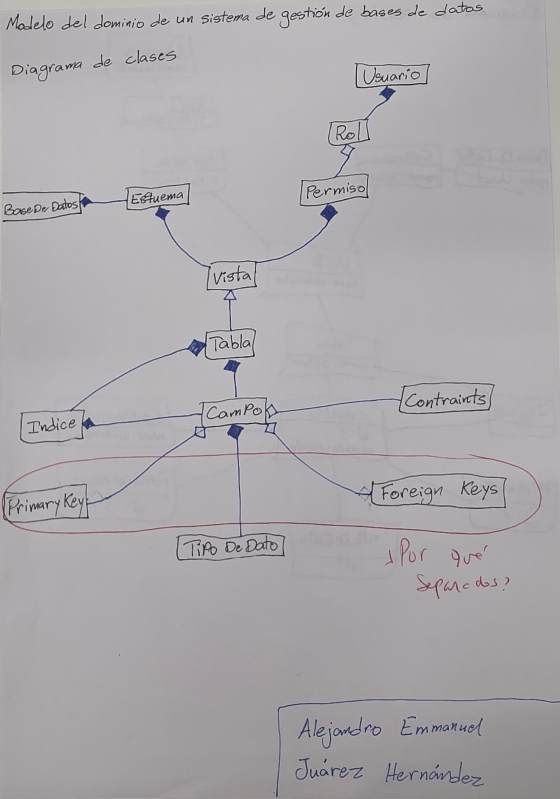
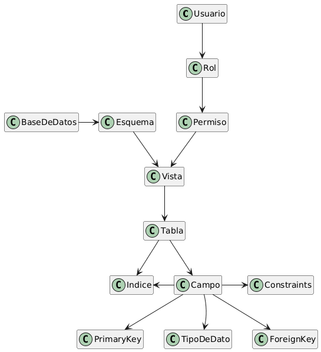
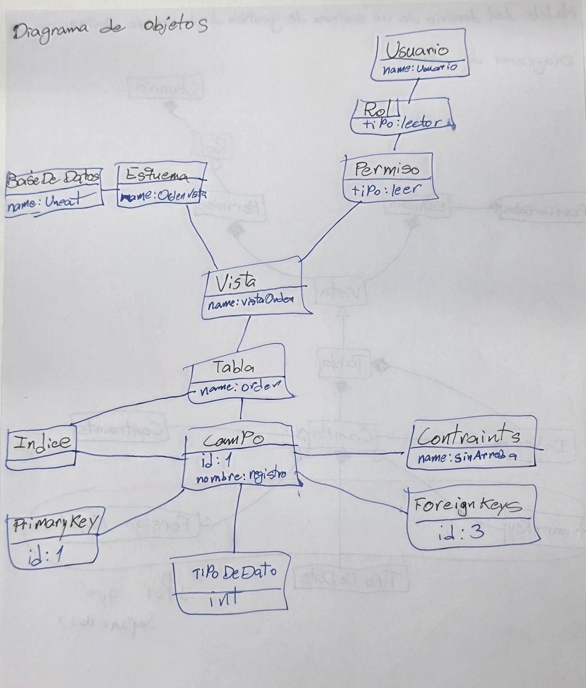
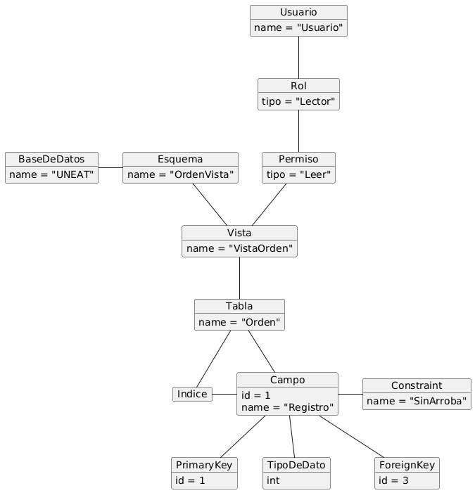
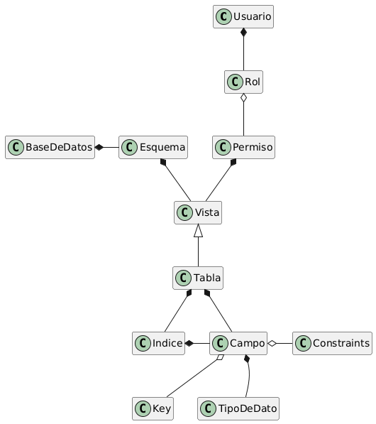
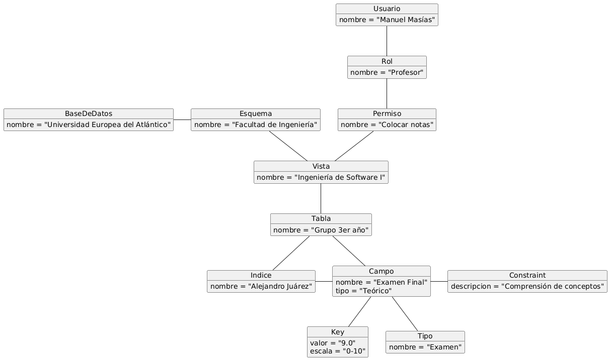
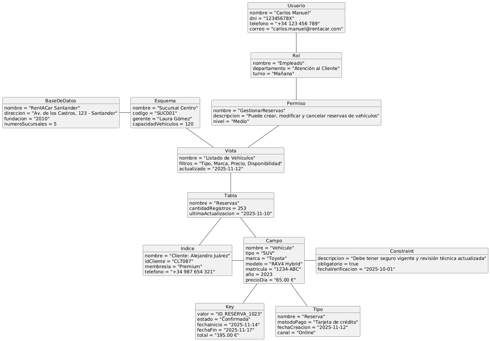

# Examen Parcial

El examen parcial consistió en **crear un modelo del dominio** (representado mediante un **Diagrama de Clases** y un **Diagrama de Objetos**) de un sistema de **gestión de bases de datos**.  
El trabajo debía realizarse con **orden, claridad y coherencia**, respetando las jerarquías y convenciones vistas en clase.

---

## Propuesta inicial

Según lo entregado en el examen (disponible en la carpeta `entregas/juarezAlejandro/examenParcial/documentos`), se elaboraron los siguientes diagramas:

### Diagrama de Clases — Propuesta inicial

|                                                                                                                                                 En papel                                                                                                                                                 |                                                                                                                                                       En PlantUML                                                                                                                                                        |
| :------------------------------------------------------------------------------------------------------------------------------------------------------------------------------------------------------------------------------------------------------------------------------------------------------: | :----------------------------------------------------------------------------------------------------------------------------------------------------------------------------------------------------------------------------------------------------------------------------------------------------------------------: |
|    [Link al diagrama de clases en papel](https://github.com/Alejandrojuarez0105/25-26-IDSW1/blob/EP-3raParte/entregas/juarezAlejandro/examenParcial/documentos/DiClPropuestaInicialPapel.png) |    [Link al diagrama de objetos en PlantUML](https://github.com/Alejandrojuarez0105/25-26-IDSW1/blob/EP-3raParte/entregas/juarezAlejandro/examenParcial/documentos/DiClPropuestaInicialBaseDeDatos.png) |

---

### Diagrama de Objetos — Propuesta inicial

|                                                                                                                                                 En papel                                                                                                                                                  |                                                                                                                                                       En PlantUML                                                                                                                                                        |
| :-------------------------------------------------------------------------------------------------------------------------------------------------------------------------------------------------------------------------------------------------------------------------------------------------------: | :----------------------------------------------------------------------------------------------------------------------------------------------------------------------------------------------------------------------------------------------------------------------------------------------------------------------: |
|    [Link al diagrama de objetos en papel](https://github.com/Alejandrojuarez0105/25-26-IDSW1/blob/EP-3raParte/entregas/juarezAlejandro/examenParcial/documentos/DiObPropuestaInicialPapel.png) |    [Link al diagrama de objetos en PlantUML](https://github.com/Alejandrojuarez0105/25-26-IDSW1/blob/EP-3raParte/entregas/juarezAlejandro/examenParcial/documentos/DiObPropuestaInicialBaseDeDatos.png) |

---

## Correcciones

Durante la revisión del examen se realizaron las siguientes modificaciones:

1. **Unificación de entidades:**  
   Se determinó que `PrimaryKey` y `ForeignKey` podían representarse como **una única entidad**, simplificando así el modelo y reduciendo el tamaño de los diagramas.

2. **Corrección de nombres y atributos:**  
   Se corrigieron errores tipográficos como `ForeignKeys → ForeignKey`, además de **agregar atributos faltantes** en el diagrama de objetos.

3. **Ampliación del modelo:**  
   Se creó un **segundo diagrama de objetos**, no como corrección, sino como una **ampliación conceptual** del modelo propuesto.

---

## Diagramas corregidos

A continuación se presentan los nuevos diagramas elaborados tras las correcciones:

|                                                                                                                         Diagrama de Clases corregido                                                                                                                          |                                                                                                                          1er Diagrama de Objetos corregido                                                                                                                           |                                                                                                                              2do Diagrama de Objetos                                                                                                                               |
| :---------------------------------------------------------------------------------------------------------------------------------------------------------------------------------------------------------------------------------------------------------------------------: | :----------------------------------------------------------------------------------------------------------------------------------------------------------------------------------------------------------------------------------------------------------------------------------: | :--------------------------------------------------------------------------------------------------------------------------------------------------------------------------------------------------------------------------------------------------------------------------------: |
|    [Link al diagrama de clases corregido](https://github.com/Alejandrojuarez0105/25-26-IDSW1/blob/EP-3raParte/entregas/juarezAlejandro/examenParcial/images/DiClCorregidoBD.png) |    [Link al diagrama de objetos corregido](https://github.com/Alejandrojuarez0105/25-26-IDSW1/blob/EP-3raParte/entregas/juarezAlejandro/examenParcial/images/1erDiObCorregidoBD.png) |    [Link al segundo diagrama de objetos](https://github.com/Alejandrojuarez0105/25-26-IDSW1/blob/EP-3raParte/entregas/juarezAlejandro/examenParcial/images/2doDiObCorregidoBD.png) |

